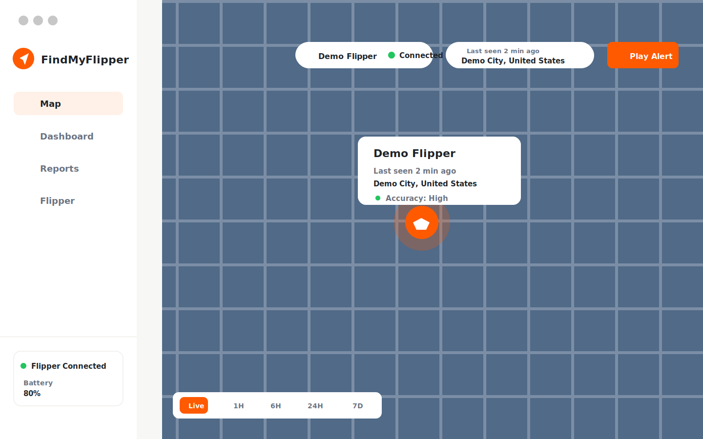
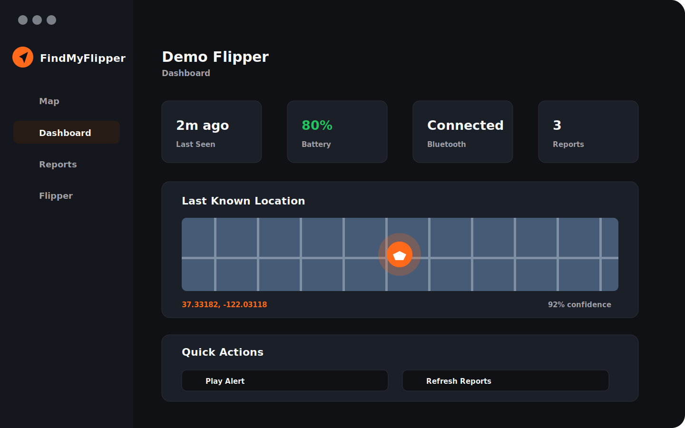

# FindMyFlipperGUI

FindMyFlipperGUI helps you work with FindMyFlipper `.keys` files and your own Flipper Zero from a desktop interface.

This repository now contains two app tracks:

- `MAIN/` and `WEB_SERVICE.PY/`: the original Electron-based desktop GUI, with the existing Windows files kept in place.
- `MAC/FindMyFlipperMac/`: the new native macOS SwiftUI app with a bundled local Python backend.

Windows users can keep using the existing Electron app. A refreshed Windows update is coming soon.

## Native macOS App

The native Mac app is a real macOS build, not an Electron wrapper. It uses SwiftUI, MapKit, CoreBluetooth, Keychain Services, local JSON persistence, a menu bar status item, and a bundled FastAPI backend for Find My report access.





### Mac Features

- Import a FindMyFlipper `.keys` file.
- Store private key material in macOS Keychain.
- Keep the generated Find My MAC separate from the CoreBluetooth device identifier.
- Connect Apple Find My report access through the bundled local backend.
- Scan nearby Bluetooth devices and save the selected Flipper CoreBluetooth identifier.
- Reconnect to the saved Flipper where macOS allows it.
- Show a map-first tracking screen with live, recent, and historical report views.
- Show reports, dashboard, profiles, Flipper detail, diagnostics, settings, and menu bar status.
- Copy generated or imported `.keys` files to the connected Flipper microSD folder at `/ext/apps_data/findmy`.
- Replace old `.keys` copies after a new identity is generated.
- Play the Flipper alert over supported Bluetooth characteristics.
- Switch between Light, Dark, System, Sunset, Ocean, Forest, and Purple themes.

### Mac Build Requirements

- macOS 14 or newer
- Xcode command line tools
- Swift 5.9 or newer
- Python 3.11 or newer

### Mac Setup

```bash
cd MAC/FindMyFlipperMac

cd Backend
python3 -m venv venv
source venv/bin/activate
pip install -r requirements.txt
cd ..

swift build
./build_and_run.sh
```

The Mac app starts the local backend automatically when launched. You can also run the backend directly:

```bash
cd MAC/FindMyFlipperMac/Backend
source venv/bin/activate
python -m findmy_gateway.server
```

The backend health endpoint is:

```text
http://127.0.0.1:8765/health
```

## Existing Electron App

The existing GUI remains in `MAIN/`. It is still useful for Windows users and for anyone who wants the original Electron workflow.

### Electron Requirements

- Node.js v14 or newer
- npm
- Python 3.7 or newer
- Bleak Python library
- A Bluetooth adapter
- A working FindMyFlipper setup

### Electron Setup

```bash
git clone https://github.com/Arxhsz/FindMyFlipperGUI.git
cd FindMyFlipperGUI/MAIN
npm install
pip install bleak
npm run dist
```

## Privacy and Safety

This project is for tracking only your own Flipper Zero and only `.keys` identities that you imported or generated yourself.

- Do not use it to track unknown devices or other people.
- The native Mac app stores private key material in macOS Keychain, not plaintext app config.
- The native Mac app stores non-secret profile, settings, and report metadata locally on your Mac.
- `.keys` generated MAC addresses and physical Bluetooth identifiers are different identities and are handled separately.
- Do not commit real `.keys` files, Apple credentials, tokens, logs containing secrets, or local runtime folders.

## Repository Layout

```text
FindMyFlipperGUI/
├── MAIN/                         # Existing Electron app
├── WEB_SERVICE.PY/               # Existing helper service integration
├── MAC/
│   └── FindMyFlipperMac/         # Native macOS SwiftUI app
│       ├── Backend/              # Bundled FastAPI backend
│       ├── Sources/              # SwiftUI app source
│       ├── Tests/                # Swift and backend-facing tests
│       ├── README.md             # Mac-specific setup docs
│       └── THIRD_PARTY_NOTICES.md
├── IMG/                          # Shared images and sanitized screenshots
└── README.md
```

## Credits

FindMyFlipperGUI is based on and compatible with the original [FindMyFlipper](https://github.com/MatthewKuKanich/FindMyFlipper) project by Matthew KuKanich.

The native Mac backend includes original-compatible parsing, key-generation, auth, and report-handling integration boundaries so the Mac app can work without requiring users to manually run a separate checkout during onboarding.

Additional thanks to the SwiftUI, MapKit, CoreBluetooth, FastAPI, Uvicorn, cryptography, Electron, Leaflet, and Bleak communities.

## License

MIT © Arxhsz
